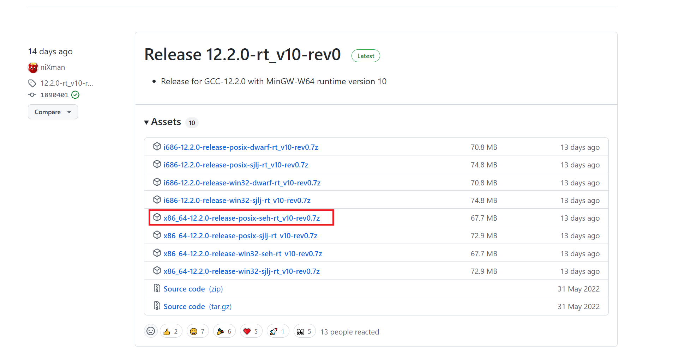
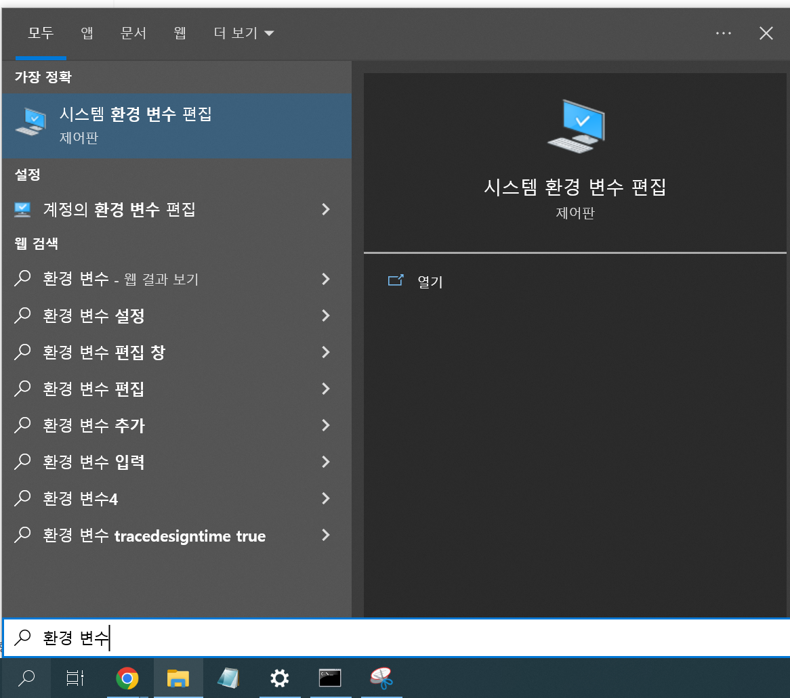
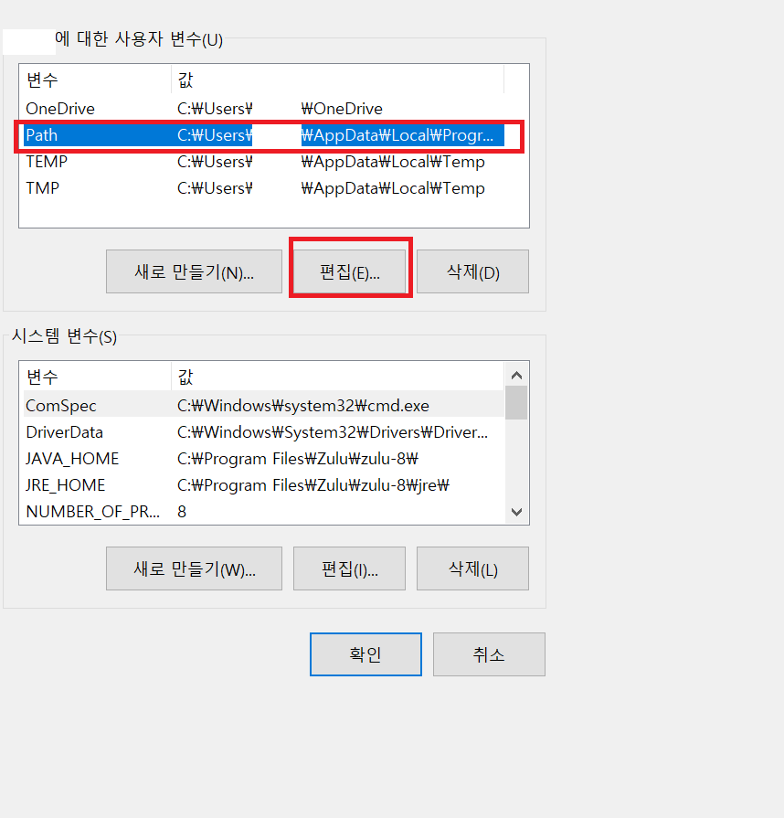
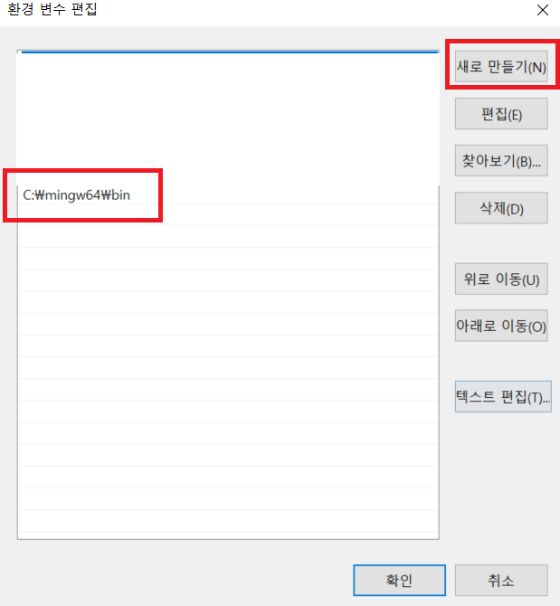
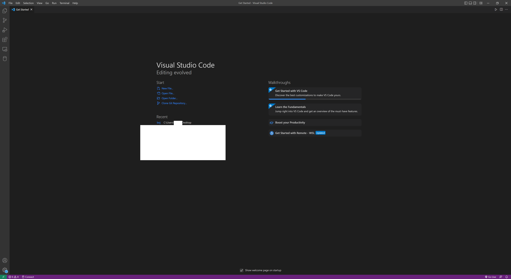
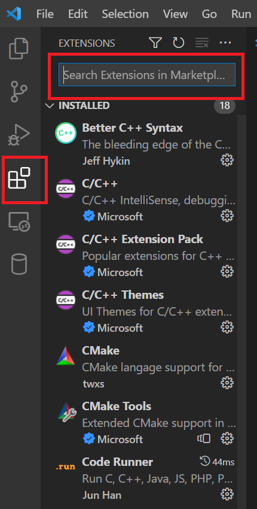
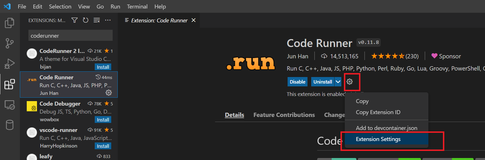
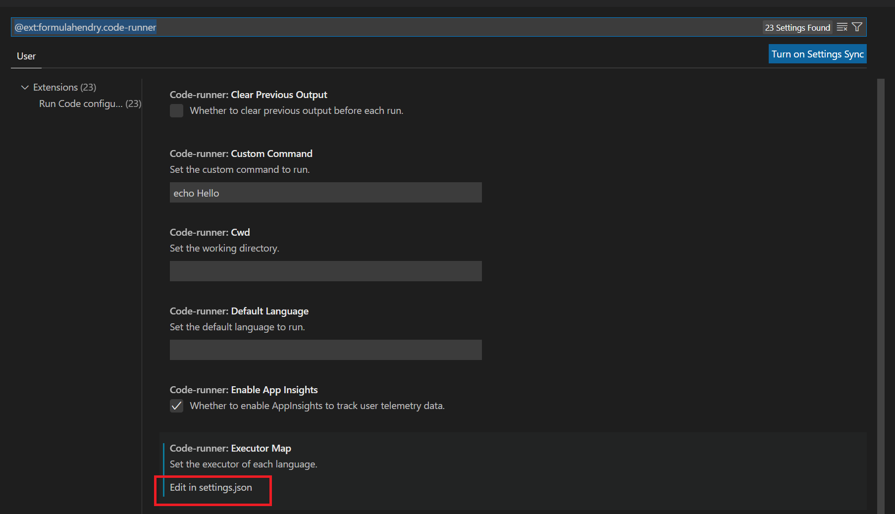
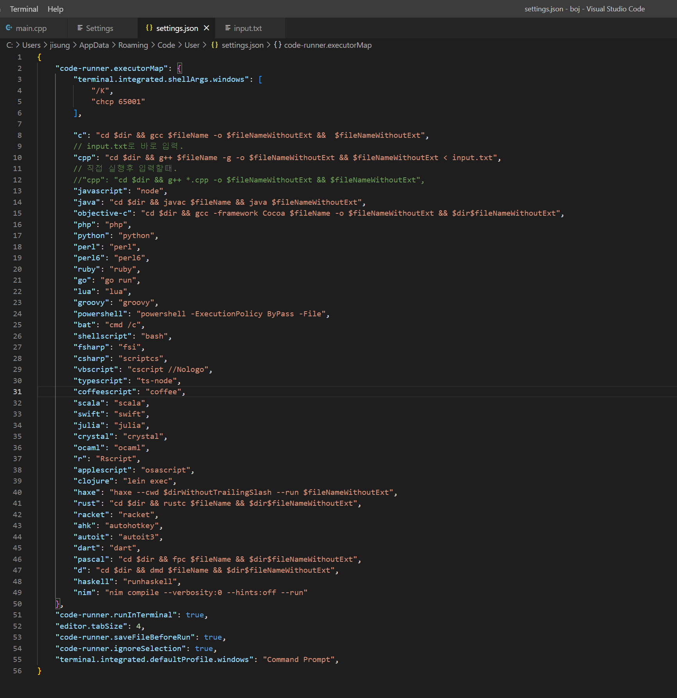
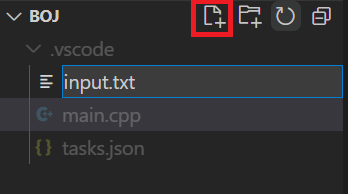

# 0. 개발환경 구축
* 코딩을 위한 개발환경을 구축해보자
* IDE는 VSC를 사용할 예정
## MINGW64 설치
* GCC 컴파일러의 윈도우 64bit 환경을 위한 프로젝트
### 다운로드 및 설치
1. https://github.com/niXman/mingw-builds-binaries/releases 접속
2. x86_64-버젼-release-posix-seh 다운로드



3. 다운로드 된 파일을 C드라이브에 압축 해제
### 환경변수 설정
1. 윈도우 검색에서 환경변수 편집을 실행한다



2. 고급 - 환경 변수 - Path - 편집



3. 새로만들기 - MINGW64설치경로\bin 입력
> C:\mingw64\bin



4. 확인을 계속 눌러 설정을 저장해주고 재부팅한다
5. cmd에서 다음의 명령어로 설치가 잘 되었는지 확인한다
> g++ -v 
* 버젼을 확인하는 명령어
## Visual Studio Code 설치
* VS와 같은 IDE 에 비해 가볍고, 기본적인 텍스트 에디터에 비해 많은 기능을 가져 사랑받고 있는 ide
* 그러나 VS와는 달리 사용하는데에 있어 설정을 좀 더 해줘야 한다
1. https://code.visualstudio.com/ 에서 다운로드 후 설치하면 된다
2. 실행한 모습



## 익스텐션 설치
* VSC는 다양한 익스텐션(추가기능)을 지원한다



* 사이드바에서 익스텐션을 선택하고 위에서 익스텐션을 검색해 필요한 익스텐션을 다운로드하자

## Code Runner 설치
* VSC 는 C++만을 위한 IDE가 아니기에 Code Runner를 통해 코드실행을 설정해주어야 한다  

1. 위의 익스텐션 설치창에서 code runner를 검색하고 설치하자
2. 설치 후 익스텐션 창에서 톱니바퀴 - Extension Setting 를 눌러 설정으로 들어간다



3. Edit in settings.json 을 눌러 설정파일에 들어간다 



4. 적절한 세팅을 입력해준다
```json
{
    "code-runner.executorMap": {
        "terminal.integrated.shellArgs.windows": [
            "/K",
            "chcp 65001"
        ],

        "c": "cd $dir && gcc $fileName -o $fileNameWithoutExt &&  $fileNameWithoutExt",
        // input.txt로 바로 입력.
        "cpp": "cd $dir && g++ $fileName -o $fileNameWithoutExt && $fileNameWithoutExt < input.txt",
        // 직접 실행후 입력할때.
        //"cpp": "cd $dir && g++ *.cpp -o $fileNameWithoutExt && $fileNameWithoutExt",
        "javascript": "node",
        "java": "cd $dir && javac $fileName && java $fileNameWithoutExt",
        "objective-c": "cd $dir && gcc -framework Cocoa $fileName -o $fileNameWithoutExt && $dir$fileNameWithoutExt",
        "php": "php",
        "python": "python",
        "perl": "perl",
        "perl6": "perl6",
        "ruby": "ruby",
        "go": "go run",
        "lua": "lua",
        "groovy": "groovy",
        "powershell": "powershell -ExecutionPolicy ByPass -File",
        "bat": "cmd /c",
        "shellscript": "bash",
        "fsharp": "fsi",
        "csharp": "scriptcs",
        "vbscript": "cscript //Nologo",
        "typescript": "ts-node",
        "coffeescript": "coffee",
        "scala": "scala",
        "swift": "swift",
        "julia": "julia",
        "crystal": "crystal",
        "ocaml": "ocaml",
        "r": "Rscript",
        "applescript": "osascript",
        "clojure": "lein exec",
        "haxe": "haxe --cwd $dirWithoutTrailingSlash --run $fileNameWithoutExt",
        "rust": "cd $dir && rustc $fileName && $dir$fileNameWithoutExt",
        "racket": "racket",
        "ahk": "autohotkey",
        "autoit": "autoit3",
        "dart": "dart",
        "pascal": "cd $dir && fpc $fileName && $dir$fileNameWithoutExt",
        "d": "cd $dir && dmd $fileName && $dir$fileNameWithoutExt",
        "haskell": "runhaskell",
        "nim": "nim compile --verbosity:0 --hints:off --run"
    },        
    "code-runner.runInTerminal": true,
    "editor.tabSize": 4,
    "code-runner.saveFileBeforeRun": true,  
    "code-runner.ignoreSelection": true,
    "terminal.integrated.defaultProfile.windows": "Command Prompt",
}
```



5. ctrl+s 를 눌러 설정을 저장해준다
* 앞으로 Ctrl+Alt+N을 통해 코드를 실행할 수 있습니다
* 디버깅은 F5 - GDB - g++를 통해 진행합니다

## Workspace 생성 및 파일 생성
1. 적절한 위치에 Workspace로 사용할 폴더를 생성한다
2. File-Open Folder... 를 통해 해당 폴더를 열어준다
3. 새 파일 버튼을 눌러 input.txt, main.cpp 두 개의 파일을 만들어준다
    * 앞으로 main.cpp에는 소스코드가, input.txt에는 입력이 들어가게 된다


